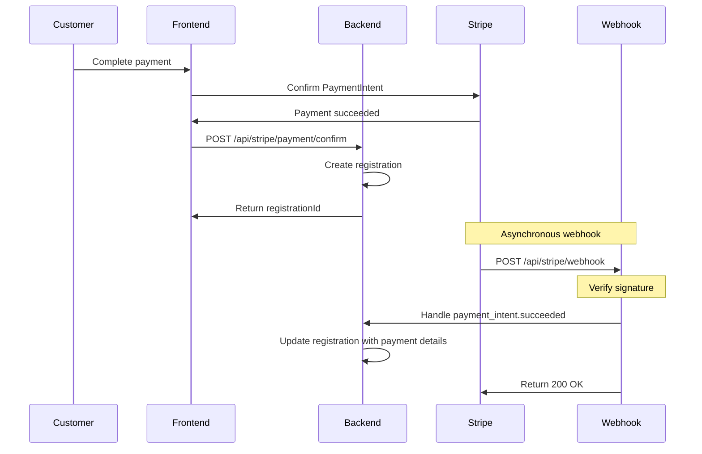

# Stripe Webhook Configuration for DEV Environment (Test Mode)

## Prerequisites
- DEV environment deployed and accessible
- Stripe account with Test Mode enabled
- Access to your DEV backend URL

## Step 1: Get Your DEV Backend Webhook URL

Your webhook endpoint will be:
```
https://your-dev-api-url.com/api/stripe/webhook
```

Example formats:
- Heroku: `https://kilnagent-dev-api.herokuapp.com/api/stripe/webhook`
- Render: `https://kilnagent-dev-api.onrender.com/api/stripe/webhook`
- Custom domain: `https://api-dev.kilnagent.com/api/stripe/webhook`

## Step 2: Configure Webhook in Stripe Dashboard

### 2.1 Access Stripe Dashboard
1. Go to https://dashboard.stripe.com/test/webhooks
2. **Make sure you're in TEST MODE** (toggle in top-right should say "Test mode")

### 2.2 Create Webhook Endpoint
1. Click **"Add endpoint"** or **"+ Add an endpoint"**
2. Enter your DEV webhook URL:
   ```
   https://your-dev-api-url.com/api/stripe/webhook
   ```
3. Optionally add description: "DEV Environment - Test Mode"

### 2.3 Select Events to Listen For

Click **"Select events"** and choose these events:

**Payment Events:**
- ✅ `payment_intent.succeeded`
- ✅ `payment_intent.payment_failed`

**Refund Events:**
- ✅ `charge.refunded`

**Connect Events (if using Stripe Connect):**
- ✅ `account.updated`

Or use **"Select all events"** for comprehensive coverage during testing.

### 2.4 Complete Setup
1. Click **"Add endpoint"**
2. The webhook will be created and you'll see the endpoint details page

### 2.5 Get Signing Secret
On the webhook details page:
1. Find the **"Signing secret"** section
2. Click **"Reveal"** or **"Click to reveal"**
3. Copy the signing secret (starts with `whsec_`)

Example: `whsec_abc123xyz789...`

## Step 3: Add Signing Secret to DEV Environment

Add the webhook signing secret to your DEV environment variables:

### For Heroku:
```bash
heroku config:set STRIPE_WEBHOOK_SECRET=whsec_abc123xyz789... -a your-dev-app-name
```

### For Render:
1. Go to your service dashboard
2. Navigate to "Environment" section
3. Add new environment variable:
   - Key: `STRIPE_WEBHOOK_SECRET`
   - Value: `whsec_abc123xyz789...`
4. Save and redeploy if needed

### For Railway/Other:
Add environment variable through your platform's dashboard:
```
STRIPE_WEBHOOK_SECRET=whsec_abc123xyz789...
```

## Step 4: Verify Configuration

### 4.1 Check Environment Variable
Ensure your backend has the secret:
```bash
# SSH into your server or use platform CLI
echo $STRIPE_WEBHOOK_SECRET
```

### 4.2 Test Webhook
In Stripe Dashboard:
1. Go to your webhook endpoint page
2. Click **"Send test webhook"**
3. Select an event (e.g., `payment_intent.succeeded`)
4. Click **"Send test webhook"**

### 4.3 Check Response
You should see:
- ✅ **Status: 200** (Success)
- Response body: `{"received":true}`

If you see errors:
- 🔴 **Status: 400** - Signature verification failed (check your secret)
- 🔴 **Status: 500** - Server error (check backend logs)

## Step 5: Test End-to-End

### 5.1 Make a Test Payment
1. Go to your DEV frontend
2. Book a class as a guest
3. Use test card: `4242 4242 4242 4242`
4. Complete payment

### 5.2 Verify Webhook Received
In Stripe Dashboard:
1. Go to **Webhooks** → Your endpoint
2. Click **"View events"**
3. You should see recent events:
   - `payment_intent.succeeded`
   - Status: Succeeded

### 5.3 Verify Database Updated
Check your database that the registration was updated with:
- `paymentStatus`: `"COMPLETED"`
- `stripeChargeId`: Populated
- `stripeFeeAmount`: Calculated (if using Connect)

### 5.4 Test Refund
1. In Stripe Dashboard, go to **Payments**
2. Find your test payment
3. Click **Refund payment**
4. Full refund: Enter full amount
5. Click **Refund**

Check that your registration updates to:
- `paymentStatus`: `"REFUNDED"`
- `refundAmount`: Full amount
- `refundedAt`: Timestamp

## Troubleshooting

### Webhook Not Receiving Events

**1. Check URL is correct:**
```bash
curl https://your-dev-api-url.com/api/stripe/webhook
# Should return: Method not allowed or similar (not 404)
```

**2. Check signing secret is set:**
```bash
# In your backend logs, look for:
echo $STRIPE_WEBHOOK_SECRET
# Should show: whsec_...
```

**3. Test with curl:**
```bash
curl -X POST https://your-dev-api-url.com/api/stripe/webhook \
  -H "Content-Type: application/json" \
  -d '{"test": "data"}'
# Should return 400 (signature verification fails, which is expected)
```

### Signature Verification Failing

**Common causes:**
1. Wrong signing secret (test vs live mode)
2. Secret not set in environment
3. Raw body parsing issue

**Solution:**
- Ensure `STRIPE_WEBHOOK_SECRET` matches the one in Stripe Dashboard
- Verify you're using the TEST mode secret (starts with `whsec_`)
- Check backend logs for detailed error messages

### Events Not Updating Database

**Check backend logs:**
```bash
# Look for webhook handler errors
tail -f logs/backend.log | grep webhook
```

**Verify event handling:**
- Open `src/services/stripe.ts`
- Check `handleWebhookEvent()` function
- Add console.log to debug:
  ```typescript
  console.log('Webhook event received:', event.type);
  ```

## Important Notes

### Test Mode vs Live Mode
- ⚠️ **DEV should use TEST MODE webhooks**
- Test mode secrets start with `whsec_test_`
- Live mode secrets start with `whsec_live_`
- **Never mix test and live secrets**

### Multiple Environments
Create separate webhook endpoints for each environment:
- DEV: `https://api-dev.kilnagent.com/api/stripe/webhook`
- STAGING: `https://api-staging.kilnagent.com/api/stripe/webhook`
- PROD: `https://api.kilnagent.com/api/stripe/webhook`

Each environment should have its own signing secret.

### Security Best Practices
1. Always verify webhook signatures
2. Use HTTPS only (never HTTP)
3. Keep signing secrets secure (never commit to git)
4. Rotate secrets periodically
5. Monitor failed webhook attempts

## Webhook Event Flow



## Next Steps

Once DEV webhooks are working:
1. Repeat this process for STAGING environment
2. Configure PROD webhooks with LIVE MODE
3. Monitor webhook delivery in Stripe Dashboard
4. Set up alerting for failed webhooks

## Support

If you encounter issues:
1. Check Stripe Dashboard → Webhooks → Event logs
2. Review backend application logs
3. Verify environment variables are set
4. Test with Stripe CLI for local debugging

---

**Status:** ✅ Webhooks configured for DEV environment (Test Mode)
**Last Updated:** February 2, 2026
